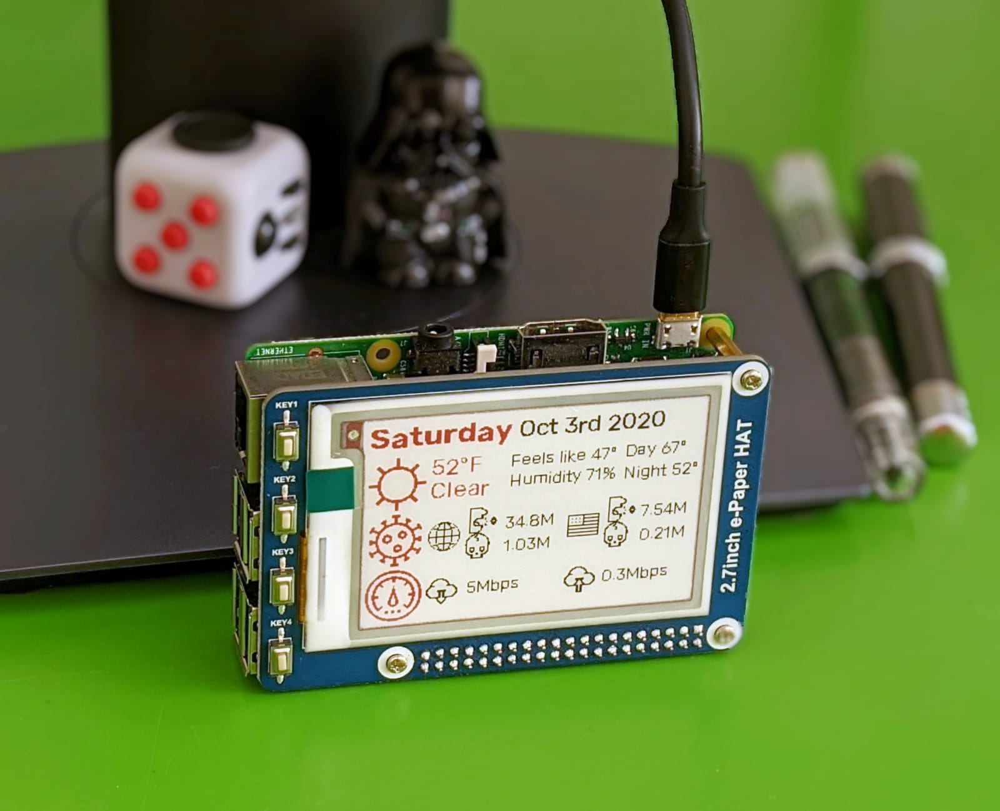
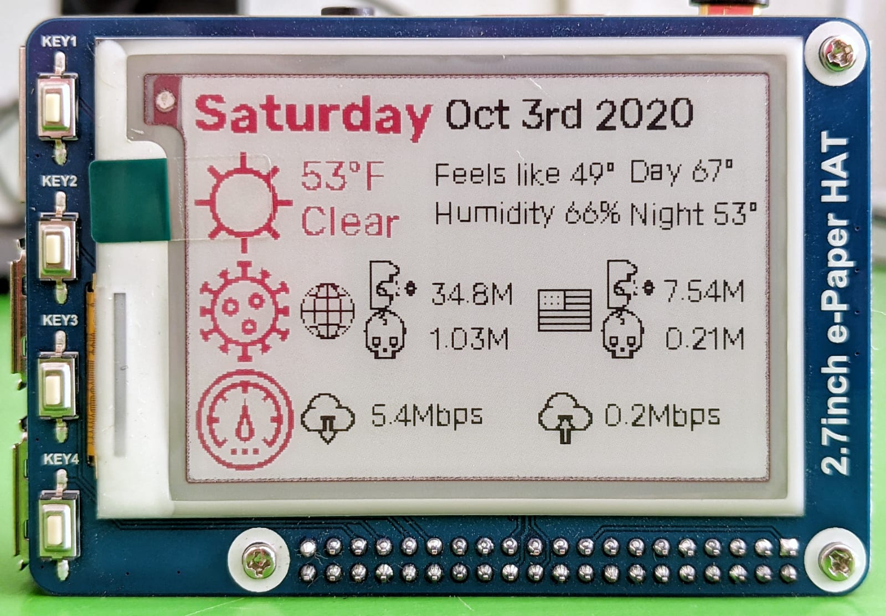

# Raspberry Pi E-Ink Dashboard
### Tri color e-ink dashboard written in Python 3.7, running on Raspberry Pi
 

# What does it do?
This dashboard displays information easily read at a glance:
 - **Date info**: day of the week, month, day of the month and year
 - **Weather info**: weather icon, current temperature, description, what it feels like, humidity and temperature range for the day
 - **Covid-19 info**: global and local infections and deaths
 - **Internet speed**: current upload and download speeds
> Any information can be displayed on the display (to-do list items, calendar events for the day, current song playing on Spotify)

## Data sources
This dashboard uses two data sources accessed via REST API:
- **Weather info**: gathered from [openweathermap.org](https://openweathermap.org/api)
- **Covid info**:  gathered from [corona.lmao.ninja](https://corona.lmao.ninja/v2/) (API version 2.0 was used for this dashboard but a newer API version is already available)
> Any datasource can be used instead of the ones chosen for this dashboard, but changing the datasource will require modifying the parsing of the response

And two local data sources:
- **Date info**: from the local machine
- **Internet speed**: by locally running the speed-test CLI application

## Software prerequisites
- [Python 3.7+](https://www.python.org/downloads/)
- [Waveshare 2.7inch E-Ink display libraries](https://www.waveshare.com/wiki/2.7inch_e-Paper_HAT_(B))
- [Node.js 8+](https://nodejs.org/)
- [Speed-Test NPM package](https://github.com/sindresorhus/speed-test)
- [Rubik font](https://fonts.google.com/specimen/Rubik) ([Raspberry Pi font installation instructions](https://raspberrytips.com/install-fonts-raspberry-pi/))
> Any font may be used instead of Rubik, but not all fonts will look good on the display, especially in smaller sizes.

## Hardware prerequisites
- Raspberry Pi (this dashboard was run on a Raspberry Pi 3 Model B but will probably work on any version)
- [Waveshare 2.7inch E-Ink display HAT for Raspberry Pi](https://www.waveshare.com/2.7inch-e-paper-hat-b.htm)

## Code configuration
- The assets used in this dashboard were chosen from [flaticon](https://www.flaticon.com/) for their aesthetics and appearances on the low resolution e-ink display used. The repository includes an icon for the US flag, if you would like to display Covid-19 data for a different country, an appropriate `<country_name>.jpeg` flag icon must be added under `dashboard/assets/covid`.
- The repository includes a `Config.py` file which holds all the configurations required to run the dashboard. In order for the dashboard to run correctly, all of the properties must be provided:
	- `lon` and `lat` are used to gather weather information for the desired location
	- `units` used to determine which temperature units will be used in the weather request. Options are `imperial` for Fahrenheit and `metric` for Celsius
	- `unit_letter` used to determine which temperature letter will be used in the display. `F` for Fahrenheit and `C` for Celsius
	- `open_weather_map_api_key` is the openweathermap.org API key.
		> An account is required to access the openweathermap.org weather API, you can register **for free** [here](https://home.openweathermap.org/users/sign_up).
	- `country` is used to query Covid-19 data and to load the flag icon so it **must** match the `<country_name>.jpeg`
	- `[small\medium\large]_font_[size\name]` were chosen to fit the size of the e-ink display

> Every application that includes usage of an e-ink display will require two files provided by the manufacturer: `epd2in7b.py` and `epdconfig.py`. These files have been provided and are in the `lib` folder in the repository so no configuration is required.

## Running
Running the dashboard requires the following steps:
- Connecting the e-ink display to the Raspberry Pi
- Cloning the repository
- Configuring the properties listed in the Code configuration section, and
- Running the `main.py` script

This will display the dashboard on the display and will not be cleared even if the Raspberry Pi is shut down or disconnected from a power source.
In order to refresh the dashboard in a predefined interval, using crontab is recommended:

 1. Run the command `crontab -e` in the CLI
 2. Add a new line to the file and insert `*/30 * * * * cd /absolute/path/to/the/project/folder && python3 main.py`
 3. Save and close the editor

> The meaning of `*/30 * * * *` is "run the following command at the top of the hour and 30 minutes past the top of the hour". More examples may be found [here](https://crontab.guru/examples.html).

> Keep in mind that it takes the dashboard approximately 70 seconds to load the required data and another 33 seconds for the display to clear and refresh, so running it too often won't be effective. Not to mention that the screen flickers when refreshing which is distracting.

## Future improvements
 - [ ] Dynamically load country flag according to provided `lon` and `lat` values
 - [ ] Load weather data according to city name instead of `lon` and `lat` values
 - [ ] Display weather data for upcoming days
 - [ ] Change Covid-19 datasource to a newer API version
 - [ ] Graph Covid-19 data for a given timeframe
 - [ ] Graph Internet speed data for a given timeframe
 - [ ] Support use of the display buttons to select which information will be displayed on screen
